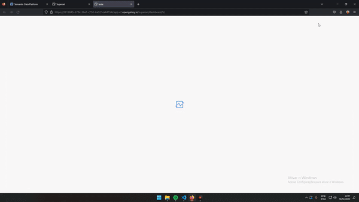

# <a target="_blank" href="https://cassiano07.github.io/SuperHelp/">SuperHelp!</a>

A helpful extension, developed by the HC Team, ready to make your life easier when dealing with CSS in Superset. Long life to he capybara!

[Overview](#-overview) • [Options](#-options-available-in-the-extension) • [Technologies](#-technologies) • [How to install](#-how-to-install) •  [Contributors](#-contributors) • [Authors](#-authors)

### 👀 Overview
The extension was developed by a team of pranksters to facilitate css activities in Superset.

### 🔎 Options available in the extension:

* Removes the CSS applied to the dashboard(**Clean CSS 1x**)
* It will keep removing the css applied to the dashboard, until you click on the option again(**CSS is the shit!!!**)
* It will edit the dashboard and open the css window, after closing the css screen on the "X" it will try to save the change automatically(**Save me capybara!**)
* change extension language

### 👨‍💻 Technologies

* <a target="_blank" href="https://developer.mozilla.org/en-US/docs/Web/JavaScript">JavaScript</a>
* <a target="_blank" href="https://developer.mozilla.org/en-US/docs/Web/HTML">HTML</a>
* <a target="_blank" href="https://developer.mozilla.org/pt-BR/docs/Web/CSS">CSS</a>
* <a target="_blank" href="https://developer.chrome.com/docs/extensions/">Extension</a>

### 👨‍🔧 How to install
In the next steps you will have description to install the extension.

#### Important informacions
* Our extension is still in validation process by chrome and mozilla, so it can be officially in their stores.

#### Prerequisites

* Browser Chrome or Browser Mozilla

#### Step by step
**Chrome:**
1. Go to the link and add it to your browser <a target="_blank" href="https://chrome.google.com/webstore/detail/superhelp/edanghndmiopbgagaaeogenbmolhoplh?hl">SuperHelp!</a>

**Mozilla:**

1. Go to the link and add it to your browser <a target="_blank" href="https://addons.mozilla.org/pt-BR/firefox/addon/superhelp/">SuperHelp!</a>
   

### 🤝 Contributors

* <a target="_blank" href="https://www.linkedin.com/in/amarilisazevedo/">Amarilis Azevedo</a>

### ✍ Authors

* <a target="_blank" href="https://www.linkedin.com/in/ccaiosilva/">Caio Silva</a>
* <a target="_blank" href="https://www.linkedin.com/in/danielcm07/">Daniel Cassiano</a>
